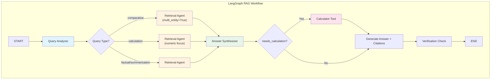

# Architecture & Design

This document explains **how** the system works, **why** certain decisions were made, and the **trade-offs** involved.

---

## 1. High-Level Workflow (LangGraph)

### Diagram

### State Management
Data flows through a strictly typed `RAGState` dictionary:
- **Input**: `query`
- **Internal**: `query_type`, `entities`, `retrieved_chunks`, `calculation_result`
- **Output**: `answer`, `citations`, `confidence_score`

---

## 2. What Each Agent Does

#### 1. Query Analyzer
- Looks at your question and figures out the type: **factual**, **comparative**, **summarization**, or **calculation**
- Pulls out the key entities (like company names, topics)
- Sets flags: `multi_entity=True` for comparisons, `requires_calculation=True` for math

#### 2. Retrieval Agent
- Searches Qdrant using hybrid search (semantic vectors + BM25 keyword matching)
- Cohere reranks the results to get the most relevant chunks
- For comparisons: searches for each entity separately so you get info about both
- For calculations: prioritizes chunks that contain numbers

#### 3. Answer Synthesizer
- Takes the retrieved chunks and generates a natural language answer
- If math is needed, uses the calculator tool (no `eval()` — safe arithmetic only)
- Adds citations: which document, which chunk, what quote
- Scores its own confidence (0.0 to 1.0)
- Checks for hallucinations

---

## 3. Retrieval Strategy (The "Special Sauce")

We use a **Hybrid Search + Reranking** pipeline to maximize precision.

### Step 1: Hybrid Search (Qdrant)
We query Qdrant twice in parallel:
1.  **Semantic Search**: `OpenAI embeddings` (captures meaning/intent).
2.  **Keyword Search (BM25)**: Exact text match (captures specific names, IDs, acronyms that vectors miss).

### Step 2: Merge & Deduplicate
Results from both searches are merged by `chunk_id`.

### Step 3: Reranking (Cohere)
The top 20 merged results are sent to **Cohere Rerank** (`rerank-english-v3.0`).
*   **Why?** Vector search uses "approximate" nearest neighbors. It often retrieves "related" but irrelevant text (e.g., retrieving "Apple pie" for "Apple stock").
*   **Result**: The Reranker scores each chunk's relevance to the specific query query. We keep only the **Top 5**.

---

## 4. Vector Database Schema

*   **Database**: Qdrant (Local mode or Docker container)
*   **Collection**: `multi_doc_rag`
*   **Vectors**: 1536 dimensions (OpenAI `text-embedding-3-small`)
*   **Distance Metric**: Cosine Similarity
*   **Payload (Metadata)**:
    *   `text`: The actual chunk content.
    *   `filename`: Source document name (e.g., `budget.pdf`).
    *   `chunk_id`: Unique UUID for the chunk.
    *   `doc_id`: UUID for the parent document.

---

## 5. Ingestion & Chunking Strategy

*   **Loaders**:
    *   PDF: `PyMuPDFLoader` (fast, reliable text extraction).
    *   DOCX: `Docx2txtLoader`.
    *   TXT: `TextLoader`.
*   **Chunking Algorithm**: `RecursiveCharacterTextSplitter`.
*   **Parameters**:
    *   `chunk_size = 800` characters.
    *   `chunk_overlap = 100` characters.
*   **Rationale**:
    *   **800 chars**: Large enough to contain a distinct fact or paragraph, but small enough to fit 5-10 chunks in the LLM context window.
    *   **100 overlap**: Prevents information loss at chunk boundaries (e.g., a sentence cut in half).

---

## 6. Design Decisions & Trade-offs

| Decision | Why we chose it |
| :--- | :--- |
| **LangGraph (State Machine)** | Allows structured flows and future extensibility (loops, human-in-the-loop). |
| **Hybrid Search** | Pure vector search fails on specific IDs/names. Pure keyword fails on synonyms. Hybrid is robust. |
| **Cohere Rerank** | Drastically improves retrieval quality (precision). |
| **Separated Safety Layer** | Keeps core logic clean. Easier to audit/modify rules. |
| **Qdrant (Local/Docker)** | Easy setup (no cloud account needed). Production-ready. |

---

## 7. Safety & Guardrails

To prevent "garbage in, garbage out":

1.  **Input Validation**:
    *   Checks for malicious patterns (Prompt Injection) before the LLM sees the query.
    *   Blocks queries with excessive special characters.
2.  **Hallucination Check**:
    *   Post-generation verify.
    *   If the LLM says "Confidence: Low" (< 0.4) OR if no chunks were found -> Flag as potentially unreliable.
